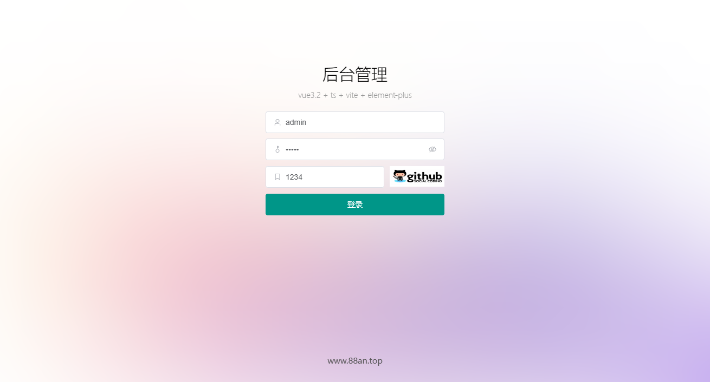
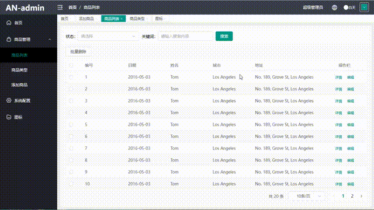
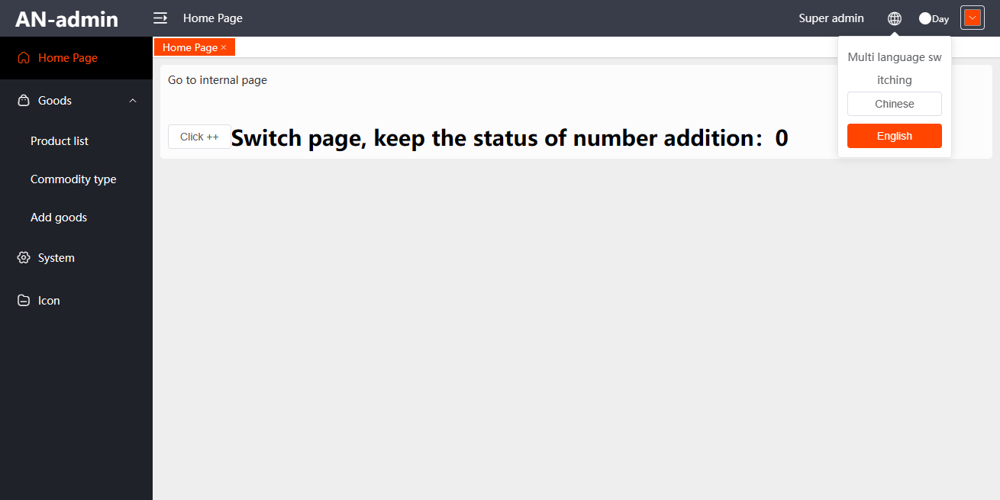
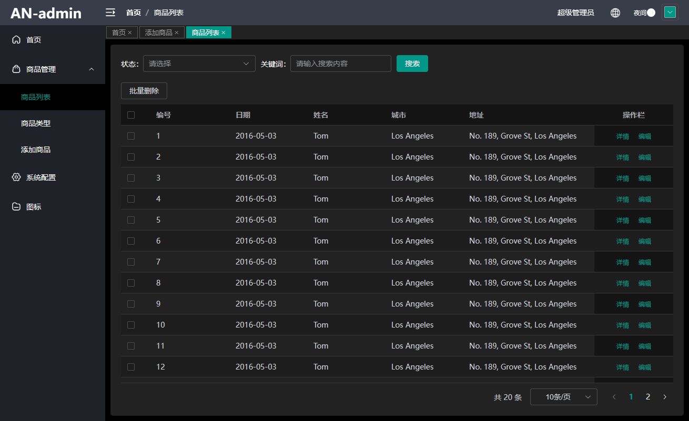
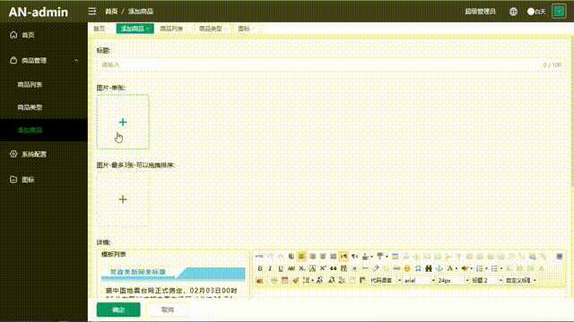
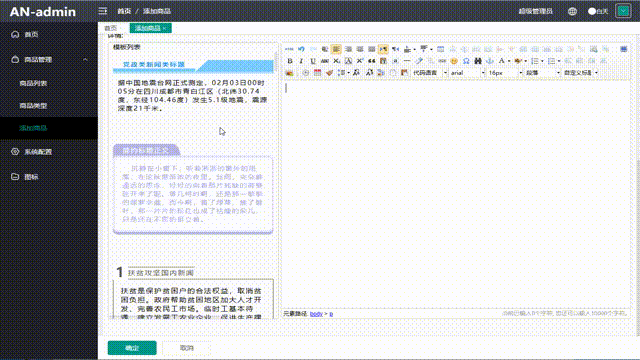
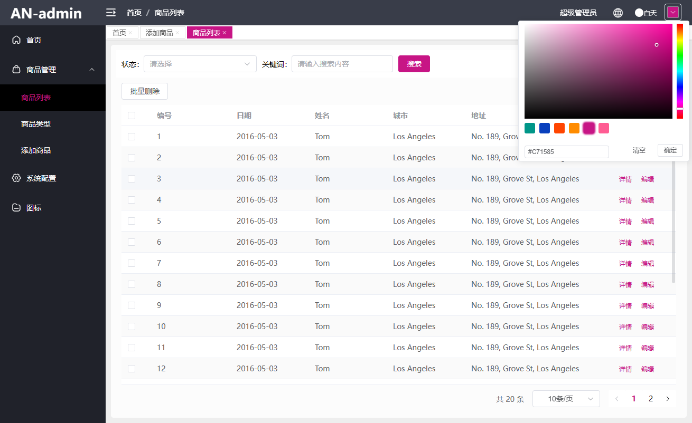
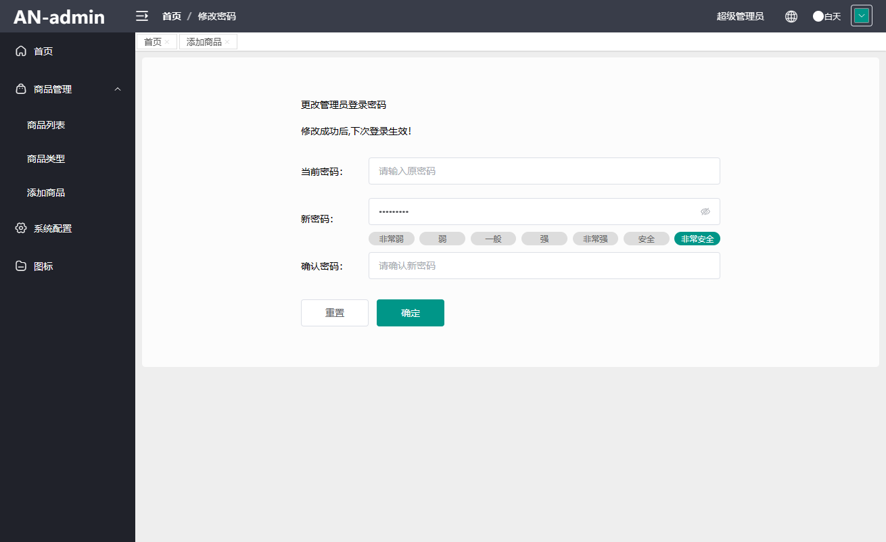

## vue3.2+ts+elementPlus+vite4
## 纯前端管理系统模板
## 可以直接拿来做启动项目

在线预览后台管理 [http://vue3.88an.top](http://vue3.88an.top)
#### 网站截图
登录<br />


路由切换过度动画<br />


多语言切换<br />


暗黑模式<br />


图片选择，拖拽排序<br />


富文本编辑，模板编辑，图片使用公共图片弹层组件<br />


主题颜色切换<br />


修改密码<br />

## Project Setup

```sh
npm install
```

### Compile and Hot-Reload for Development

```sh
npm run dev
```

### Type-Check, Compile and Minify for Production

```sh
npm run build
```
